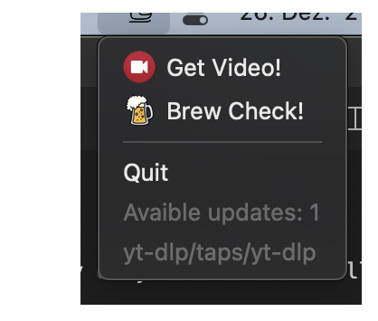

# Custom MacOS Menu Bar App with python + rumps

By chance a got to know [rumps](https://github.com/jaredks/rumps) a really fantastic python package for making menu bar apps on MacOS. With this it's really easy to build a small menu bar app that suits one personal needs.



It comes in handy to automatize daily routines like 
```
brew update
brew outdated
brew upgrade
```
or just quickly download a video for private use and offline watching.

But these are only two examples. The menu bar app can be extended or changed to ones personal needs.

To build a stand alone version the also great python package [Py2App](https://py2app.readthedocs.io/en/latest/) comes into play.

## Getting Started

### Dependencies

* Only works on MacOS (tested on Montery 12.1 with a Apple Silicon Chip (M1))
* Python 3.10
* Rumps: https://github.com/jaredks/rumps
* Py2App: https://py2app.readthedocs.io/en/latest/
* The other packages are just for demonstration purposes.

### Installing

* Copy & clone the source code.
* Set up a virtual environment: ```python3 -m venv venv```
* Pip install requirements: ```pip3 install -r requirements.txt```


### Executing program
```
python3 statusbarApp.py
```

```Get Video!```only works when your Safari Browser has an active tap open with a suitable url (e.g. youtube.com/example-video).

```Brew check!``` runs ```brew update && brew outdated``` in one go. I am still working on adding ```brew upgrade```. 

## Stand alone version

To build a stand alone version you need in addition the ```setup.py``` and ```py2app```. 
Put all files togehter in one folder and run following command:
```
python3 setup.py py2app --emulate-shell-environment
```

## License

This project is licensed under the MIT License - see the LICENSE.md file for details.


## Acknowledgments

* [Beer 1 Icon (iconka.com)](https://iconarchive.com/icons/iconka/lucky-leprechaun/license.txt)
* [Transport Helicopter Icon](https://icons8.com/)
* [Video camera Icon](https://iconarchive.com/show/circle-icons-by-martz90/video-camera-icon.html)

